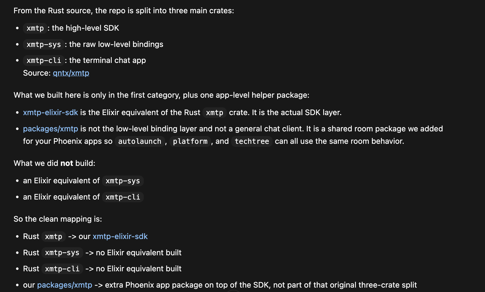

# XmtpElixirSdk

[Hex package](https://hex.pm/packages/xmtp_elixir_sdk/0.1.0)  
[Docs](https://hexdocs.pm/xmtp_elixir_sdk/0.1.0)

Elixir-first XMTP SDK ported from the browser SDK surface, with a minimal browser
shim kept only for browser-only runtime concerns such as workers and browser
storage.

This SDK is built as a port from [qntx/xmtp](https://github.com/qntx/xmtp).



## Installation

The package is designed to be published to Hex and can be installed by adding
`xmtp_elixir_sdk` to your list of dependencies in `mix.exs`:

```elixir
def deps do
  [
    {:xmtp_elixir_sdk, "~> 0.1.0"}
  ]
end
```

## Scope

- The Elixir package owns the SDK behavior, state, and public API.
- The `browser_shim/` directory is a separate TypeScript helper layer for
  browser-only runtime behavior and is not bundled into the Hex package.

## Browser Wallet Signing

Keep browser wallet providers at the app layer. The Elixir SDK stays provider
neutral and exposes generic signature-request flows for app code to complete.

The intended browser flow is:

1. Build an XMTP client from the wallet address you want to use as the XMTP identity.
2. Ask the SDK for the current signature request text.
3. Have the browser wallet sign that exact text.
4. Send the resulting signature back to the server.
5. Apply the signature request and continue with the XMTP action.

That pattern lets Phoenix and LiveView apps use Privy, injected wallets, or any
other browser signer without adding wallet-vendor code to the Hex package.

## Publishing

Build the package locally with:

```bash
mix hex.build
```

Publish it with:

```bash
mix hex.publish
```
